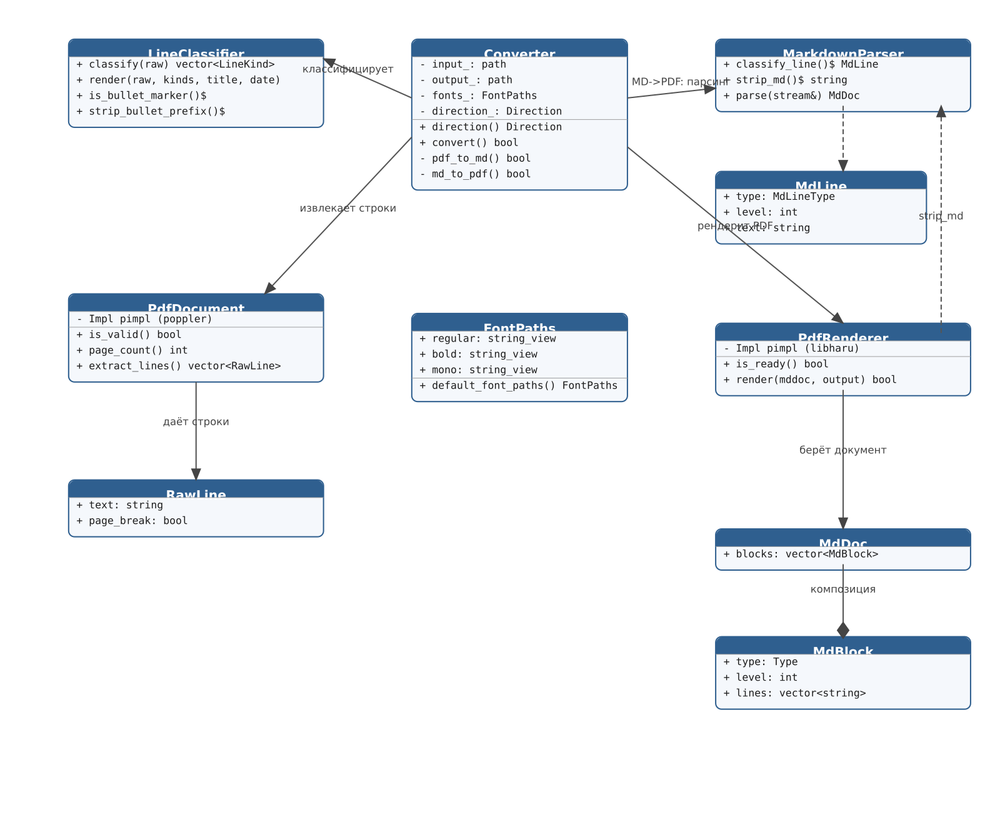

# pdf2md

Copyright (c) 2026 Alexey.Khoraskin@gmail.com  
Licensed under the Apache License, Version 2.0  
https://github.com/alexeykhoraskin/MyTools/tree/main/pdf2md

Инструмент для двусторонней конвертации между PDF и Markdown на C++20.

## Возможности

- **PDF → MD** — извлечение текста из PDF в Markdown (через Poppler)
  - заголовки, абзацы (склейка строк), списки, разделители страниц `---`
  - эвристика классификации строк (короткие строки ≈ заголовки, буллеты и т.п.)
- **MD → PDF** — преобразование Markdown в PDF (через libharu + собственный парсер)
  - заголовки, абзацы, списки, блоки кода, горизонтальные линии
  - inline-разметка (`**bold**`, `*italic*`, `` `code` ``, `[link](url)`) очищается
- **Юникод** — имена файлов с пробелами и кириллицей поддерживаются в обе стороны
- Направление конвертации определяется автоматически по расширениям файлов

## Архитектура

Модульная структура (C++20, `std::string_view`, объектно-ориентированный дизайн):

| Модуль | Файл | Назначение |
|--------|------|------------|
| `text_utils` | `include/pdf2md/text_utils.hpp` | `trim`/`vis_len` на `string_view` |
| `LineClassifier` | `include/pdf2md/pdf_classify.hpp` | чистая логика PDF→MD (без внешних зависимостей) |
| `PdfDocument` | `include/pdf2md/pdf_extract.hpp` | загрузка PDF и извлечение строк (Poppler) |
| `MarkdownParser` | `include/pdf2md/md_parse.hpp` | разбор Markdown, `strip_md` (без внешних зависимостей) |
| `PdfRenderer` | `include/pdf2md/md_render.hpp` | рендер Markdown → PDF (libharu, pimpl) |
| `Converter` | `include/pdf2md/converter.hpp` | пайплайн конвертации, определение направления |

Логика (парсеры, классификация) изолирована от I/O и покрыта unit-тестами.

### Диаграмма классов



Таблица модулей и диаграмма отражают текущую структуру библиотеки `pdf2md`.

## Зависимости (build)

```bash
sudo apt install libpoppler-cpp-dev libhpdf-dev
```

Для сборки тестов также нужен GoogleTest:

```bash
sudo apt install libgtest-dev
```

## Сборка

```bash
cmake -S . -B build
cmake --build build -j$(nproc)
```

Установка:

```bash
cmake --install build
```

### Тесты

Тесты написаны на GoogleTest (GTest). Через `gtest_discover_tests()` каждая `TEST`-группа регистрируется отдельно в CTest:

```bash
ctest --test-dir build --output-on-failure
```

Наборы: `TextUtils`, `LineClassifier`, `MarkdownParser` (всего 21 тест).
Отключить тесты: `cmake -B build -DPDF2MD_BUILD_TESTS=OFF`.

## Использование

```bash
./build/pdf2md документ.pdf  документ.md    # PDF -> Markdown
./build/pdf2md документ.md   документ.pdf   # Markdown -> PDF
```

Направление определяется автоматически по расширениям файлов.

### Параметры

| Параметр        | Описание              |
|-----------------|-----------------------|
| `-h`, `--help`  | Показать справку      |
| `-v`, `--version`| Показать версию      |

## Поддерживаемый Markdown

- Заголовки (`#` .. `######`)
- Абзацы
- Жирный (`**text**`) и курсив (*italic*) — очищается от разметки в PDF
- Списки (`- item`)
- Блоки кода (`` ``` ``)
- Горизонтальные линии (`---`)
